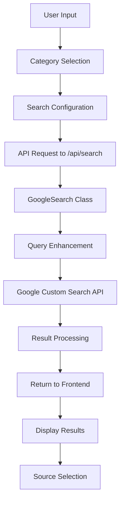
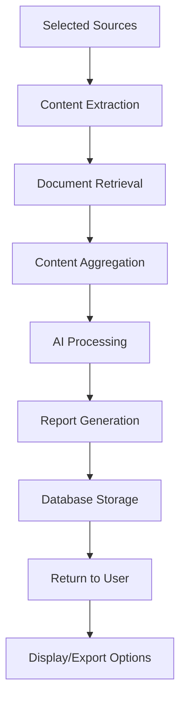
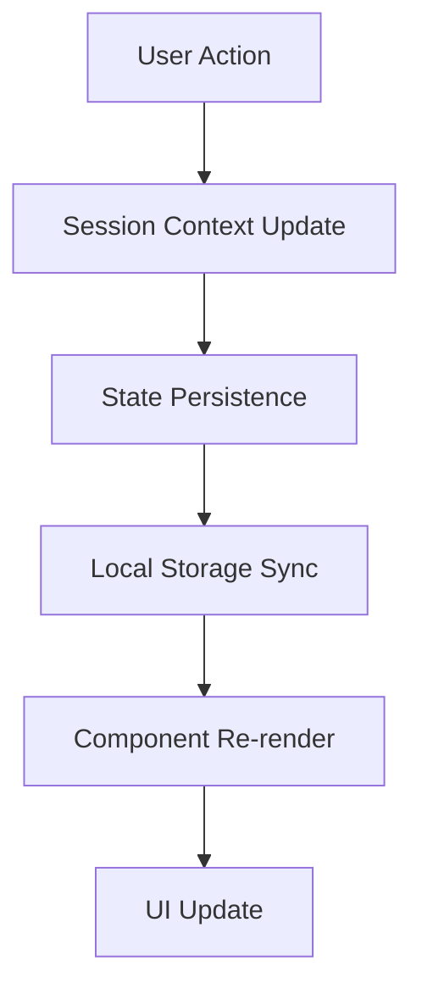

# Querra Technical Documentation

## Table of Contents
1. [Architecture Overview](#architecture-overview)
2. [Data Flow & Logic](#data-flow--logic)
3. [Core Modules](#core-modules)
4. [API Endpoints](#api-endpoints)
5. [Category System](#category-system)
6. [Search Implementation](#search-implementation)
7. [AI Processing Pipeline](#ai-processing-pipeline)
8. [Database Architecture](#database-architecture)
9. [Component Architecture](#component-architecture)
10. [State Management](#state-management)
11. [Error Handling](#error-handling)
12. [Performance Optimizations](#performance-optimizations)

## Architecture Overview

Querra follows a modern Next.js full-stack architecture with the following layers:

```
┌─────────────────────────────────────────────────────────────┐
│                    Frontend (React/Next.js)                 │
├─────────────────────────────────────────────────────────────┤
│                    API Routes (Next.js)                     │
├─────────────────────────────────────────────────────────────┤
│                  Business Logic Layer                       │
│  ┌─────────────┐ ┌─────────────┐ ┌─────────────┐            │
│  │   Search    │ │     AI      │ │  Database   │            │
│  │   Engine    │ │ Processor   │ │   Manager   │            │
│  └─────────────┘ └─────────────┘ └─────────────┘            │
├─────────────────────────────────────────────────────────────┤
│                   External APIs                             │
│  ┌─────────────┐ ┌─────────────┐ ┌─────────────┐            │
│  │   Google    │ │   Google    │ │   Content   │            │
│  │   Search    │ │   Gemini    │ │ Extraction  │            │
│  └─────────────┘ └─────────────┘ └─────────────┘            │
└─────────────────────────────────────────────────────────────┘
```

### Technology Stack Details

- **Frontend Framework**: Next.js 15.2.4 with React 18
- **Language**: TypeScript 5.7.3 for type safety
- **Styling**: Tailwind CSS 4.0.6 with Heroicons
- **Database**: SQLite3 with in-memory fallback
- **AI/ML**: Google Generative AI (Gemini 2.5 Flash)
- **Search**: Google Custom Search API
- **Content Processing**: Cheerio for HTML parsing, PDF-parse for documents

## Data Flow & Logic

### 1. Search Flow



### 2. Report Generation Flow



### 3. Session Management Flow



## Core Modules

### 1. Search Engine (`src/utils/search.ts`)

**Purpose**: Handles Google Custom Search API integration with advanced filtering.

**Key Features**:
- Multiple API request batching (Google limit: 10 results per request)
- Time-based filtering using `dateRestrict` parameter
- Domain exclusion using Google search syntax
- Query enhancement based on category

**Implementation Details**:
```typescript
class GoogleSearch {
  private api_key: string | undefined;
  private cx: string | undefined;
  private endpoint: string = "https://www.googleapis.com/customsearch/v1";

  // Converts user-friendly time filters to Google API format
  private _get_date_restrict(timeFilter: string): string | null {
    const filters = {
      "Past 24 hours": "d1",
      "Past week": "w1", 
      "Past month": "m1",
      "Past year": "y1"
    };
    return filters[timeFilter] || null;
  }

  // Formats excluded domains for Google search syntax
  private _format_excluded_domains(domains: string[]): string {
    return domains.map(domain => `-site:${domain}`).join(' ');
  }
}
```

### 2. AI Processor (`src/utils/ai_processor.ts`)

**Purpose**: Manages Google Gemini AI integration for content synthesis.

**Key Features**:
- Retry mechanism with exponential backoff
- Rate limiting handling
- Dynamic prompt generation
- Content length optimization

**Implementation Details**:
```typescript
class GeminiProcessor {
  private genAI: GoogleGenerativeAI;
  private model: any;
  private maxRetries: number = 3;
  private retryDelay: number = 1000;

  async generate_report(query: string, contents: string[], promptTemplate: string): Promise<string> {
    // Implements retry logic with rate limit handling
    for (let attempt = 1; attempt <= this.maxRetries; attempt++) {
      try {
        const prompt = this._prepare_prompt({ query, contents, promptTemplate });
        const result = await this.model.generateContent({
          contents: [{ role: "user", parts: [{ text: prompt }] }],
          generationConfig: {
            temperature: 0.7,
            topK: 40,
            topP: 0.95,
            maxOutputTokens: 2048,
          },
        });
        return result.response.text();
      } catch (error) {
        // Handle rate limiting and other errors
      }
    }
  }
}
```

### 3. Content Extractor (`src/utils/extractor.ts`)

**Purpose**: Extracts clean content from web pages and documents.

**Key Features**:
- HTML parsing and cleaning
- PDF text extraction
- Fallback content generation
- Content length optimization

**Implementation Details**:
```typescript
class ContentExtractor {
  private headers = {
    'User-Agent': 'Mozilla/5.0...',
    // Additional headers for better compatibility
  };

  async extract(url: string): Promise<string> {
    try {
      const response = await axios.get(url, { 
        headers: this.headers,
        timeout: 15000,
        maxRedirects: 5,
        maxContentLength: 10 * 1024 * 1024, // 10MB limit
      });
      
      return this.parseContent(response.data, url);
    } catch (error) {
      return this.generatePlaceholderContent(url);
    }
  }

  private parseContent(html: string, url: string): string {
    const $ = cheerio.load(html);
    
    // Remove non-content elements
    $('script, style, iframe, nav, footer, header, aside').remove();
    
    // Extract main content areas
    const contentSelectors = [
      'main', 'article', '.content', '.post-content',
      '.entry-content', '#content', '.main-content'
    ];
    
    // Content extraction and cleaning logic
  }
}
```

### 4. Database Manager (`src/utils/database.ts`)

**Purpose**: Handles data persistence with SQLite and serverless compatibility.

**Key Features**:
- Dual-mode operation (SQLite/In-memory)
- Automatic table creation
- Environment detection
- Transaction management

**Implementation Details**:
```typescript
class Database {
  private db: SQLiteDatabase | null = null;
  private isServerless: boolean;
  private inMemoryDB = {
    reports: [],
    documents: [],
    reportCounter: 0,
    documentCounter: 0
  };

  constructor() {
    this.isServerless = process.env.VERCEL_ENV !== undefined;
  }

  async save_report(query: string, content: string, sources: string[]): Promise<number> {
    if (this.isServerless) {
      // In-memory storage for serverless environments
      return this.saveReportInMemory(query, content, sources);
    } else {
      // SQLite storage for traditional environments
      return this.saveReportSQLite(query, content, sources);
    }
  }
}
```

## API Endpoints

### 1. `/api/search` - Web Search Endpoint

**Method**: POST
**Purpose**: Performs web search using Google Custom Search API

**Request Body**:
```typescript
{
  query: string;
  maxResults: number;
  timeFilter: string;
  category?: string;
  excludedDomains?: string[];
  page?: number;
}
```

**Response**:
```typescript
SearchResult[] = {
  title: string;
  url: string;
  snippet: string;
}[]
```

**Implementation Logic**:
1. Validate request parameters
2. Enhance query based on category
3. Call GoogleSearch class
4. Return formatted results

### 2. `/api/generate` - Report Generation Endpoint

**Method**: POST
**Purpose**: Generates AI-powered research reports

**Request Body**:
```typescript
{
  query: string;
  sources: string[];
  documentIds: number[];
  promptTemplate: string;
}
```

**Response**:
```typescript
{
  report: string;
}
```

**Implementation Logic**:
1. Extract content from web sources
2. Retrieve document content from database
3. Combine all content sources
4. Generate report using AI processor
5. Save report to database
6. Return generated report

### 3. `/api/documents` - Document Management

**Methods**: GET, POST, DELETE
**Purpose**: Handles document upload, retrieval, and deletion

**GET Response**:
```typescript
Document[] = {
  id: number;
  name: string;
  path: string;
  created_at: string;
}[]
```

### 4. `/api/reports` - Report Management

**Methods**: GET, DELETE
**Purpose**: Manages saved research reports

## Category System

### Category Configuration Structure

Each category in `src/config/categories.ts` contains:

```typescript
interface CategoryConfig {
  id: string;                    // Unique identifier
  name: string;                  // Display name
  description: string;           // Category description
  icon: string;                  // Heroicon name
  defaultPrompt: string;         // AI prompt template
  searchInstructions: string;    // Search guidance
  color: string;                 // UI color theme
}
```

### How Categories Enhance Search

1. **Query Enhancement**: Categories modify search queries to target specific domains
2. **Prompt Customization**: Each category has specialized AI prompts
3. **Result Filtering**: Categories influence search result ranking
4. **UI Adaptation**: Different visual themes and instructions per category

### Category-Specific Behaviors

#### Academic Search
- **Query Enhancement**: Adds terms like "research", "study", "journal"
- **Domain Priority**: Prioritizes .edu, .org domains
- **Prompt Style**: Formal academic writing with citations
- **Output Format**: Structured with methodology and conclusions

#### Financial Analysis
- **Query Enhancement**: Adds terms like "market", "financial", "analysis"
- **Time Sensitivity**: Emphasizes recent data
- **Prompt Style**: Analytical with risk assessments
- **Output Format**: Charts suggestions and numerical data

#### Technology Review
- **Query Enhancement**: Adds terms like "specs", "review", "comparison"
- **Source Types**: Tech blogs, documentation, user reviews
- **Prompt Style**: Technical with pros/cons analysis
- **Output Format**: Feature comparison tables

#### Health & Medical
- **Query Enhancement**: Adds terms like "medical", "clinical", "health"
- **Source Verification**: Emphasizes medical authorities
- **Prompt Style**: Evidence-based with disclaimers
- **Output Format**: Symptoms, treatments, prevention

#### Legal Search
- **Query Enhancement**: Adds terms like "law", "legal", "court"
- **Jurisdiction Awareness**: Considers legal jurisdiction
- **Prompt Style**: Formal legal terminology
- **Output Format**: Cases, statutes, precedents

## Search Implementation

### Google Custom Search Integration

The search system leverages Google's Custom Search API with several enhancements:

#### 1. Batch Processing
```typescript
// Google API only allows 10 results per request
const requestsNeeded = Math.ceil(maxResults / 10);

for (let i = 0; i < requestsNeeded; i++) {
  const startIndex = i * 10 + 1; // Google uses 1-based indexing
  // Make individual requests and aggregate results
}
```

#### 2. Query Enhancement
```typescript
let enhancedQuery = query;

// Add category-specific terms
if (category && category !== 'general') {
  enhancedQuery = `${query} ${category}`;
}

// Add domain exclusions
if (excludedDomains && excludedDomains.length > 0) {
  enhancedQuery = `${query} ${this._format_excluded_domains(excludedDomains)}`;
}
```

#### 3. Time Filtering
```typescript
const dateRestrictMap = {
  "Past 24 hours": "d1",
  "Past week": "w1",
  "Past month": "m1", 
  "Past year": "y1"
};
```

### Search Result Processing

1. **Deduplication**: Remove duplicate URLs
2. **Content Validation**: Ensure results have titles and snippets
3. **URL Validation**: Check for valid HTTP/HTTPS URLs
4. **Pagination**: Support for client-side pagination

## AI Processing Pipeline

### 1. Dual-Mode Architecture

Querra now supports two distinct generation modes:

#### Traditional Mode (Content Extraction)
```typescript
const contentPreparationPipeline = [
  'extractWebContent',      // Extract text from HTML using Cheerio
  'extractDocumentContent', // Extract text from PDF/DOCX files
  'cleanContent',          // Remove noise and formatting
  'truncateContent',       // Limit to token constraints
  'combineContent'         // Merge all sources
];
```

#### Fast Mode (URL Context)
```typescript
const fastModeProcessing = [
  'prepareURLList',        // Format URLs with numbering
  'enhancePrompt',         // Add structured formatting instructions
  'invokeURLContext',      // Use Gemini's URL context tool
  'processResponse'        // Handle response and metadata
];
```

### 2. Mode Selection Logic

The system intelligently selects processing mode based on:

```typescript
if (generationMode === 'fast' && documentIds.length === 0) {
  // Pure fast mode: URLs only
  report = await ai_processor.generate_report_fast(query, sources, promptTemplate);
} else if (generationMode === 'fast' && documentIds.length > 0) {
  // Hybrid mode: Fall back to traditional for document support
  report = await ai_processor.generate_report(query, allContents, promptTemplate);
} else {
  // Traditional mode: Full content extraction
  report = await ai_processor.generate_report(query, allContents, promptTemplate);
}
```

### 3. Enhanced Prompt Engineering

#### Fast Mode Prompts
Fast mode uses enhanced prompts for better formatting:

```typescript
const fastModePrompt = `Search Topic: ${query}

${promptTemplate}

Source Materials:
[1] https://example1.com
[2] https://example2.com

Please generate a comprehensive research report with:

# Research Report: ${query}

## Executive Summary
## Key Findings  
## Detailed Analysis
## Recommendations
## Sources

FORMATTING REQUIREMENTS:
- Proper Markdown headings (# ## ###)
- Citations as [1], [2] when referencing sources
- Bold important terms with **text**
- Professional academic formatting
- Include title and date
`;
```

#### Traditional Mode Prompts
Traditional mode uses extracted content:

```typescript
const traditionalPrompt = `
Search Topic: ${query}

Instructions: ${promptTemplate}

Source Materials:
Source 1:
${extractedContent1}

Source 2: 
${extractedContent2}

Generate comprehensive report with citations...
`;
```

### 4. Dual AI Model Configuration

#### Fast Mode Configuration
```typescript
const fastModeConfig = {
  model: "gemini-2.5-flash",
  config: {
    tools: [{ urlContext: {} }],      // URL context tool
    temperature: 0.7,
    topK: 40,
    topP: 0.95,
    maxOutputTokens: 4096,            // Increased for rich formatting
    responseModalities: ["TEXT"],
  }
};
```

#### Traditional Mode Configuration  
```typescript
const traditionalModeConfig = {
  contents: [{ role: "user", parts: [{ text: prompt }] }],
  generationConfig: {
    temperature: 0.7,
    topK: 40,
    topP: 0.95,
    maxOutputTokens: 2048,
  }
};
```

### 5. Error Handling & Retries

Both modes implement robust error handling:

#### Fast Mode Error Handling
```typescript
// Fast mode with URL context fallback
for (let attempt = 1; attempt <= maxRetries; attempt++) {
  try {
    const response = await this.genAINew.models.generateContent({
      model: "gemini-2.5-flash",
      contents: [prompt],
      config: { tools: [{ urlContext: {} }] }
    });
    return response.text || 'No response generated';
  } catch (error) {
    if (error?.status === 429) {
      await this.delay(retryDelay * attempt); // Exponential backoff
      continue;
    }
    // Could fallback to traditional mode here
    throw error;
  }
}
```

#### Traditional Mode Error Handling
```typescript
// Traditional mode with content extraction
for (let attempt = 1; attempt <= maxRetries; attempt++) {
  try {
    return await this.model.generateContent(request);
  } catch (error) {
    if (error?.status === 429) {
      await this.delay(retryDelay * attempt);
      continue;
    }
    throw error; // Non-recoverable error
  }
}
```

## Generation Modes Architecture

### Mode Selection Strategy

The application implements intelligent mode selection based on content types:

```typescript
// Mode selection logic in API endpoint
if (generationMode === 'fast') {
  if (documentIds && documentIds.length > 0) {
    // Documents require traditional mode for accuracy
    console.log('Documents detected, falling back to traditional mode');
    return await processTraditionalMode(query, sources, documentIds, promptTemplate);
  } else {
    // Pure fast mode with URLs only
    return await processFastMode(query, sources, promptTemplate);
  }
} else {
  // Explicit traditional mode selection
  return await processTraditionalMode(query, sources, documentIds, promptTemplate);
}
```

### Performance Comparison

| Aspect | Traditional Mode | Fast Mode |
|--------|------------------|-----------|
| **Processing Time** | 30-60 seconds | 10-20 seconds |
| **Content Extraction** | Full HTML parsing | URL context only |
| **Document Support** | ✅ PDF, DOCX, TXT | ❌ URLs only |
| **Content Depth** | Maximum detail | Context-based |
| **API Calls** | Multiple (extraction + AI) | Single (AI only) |
| **Accuracy** | Highest | High |
| **Token Usage** | Higher | Lower |
| **Rate Limiting** | More susceptible | Less susceptible |

### Architecture Benefits

#### Traditional Mode Advantages:
- **Maximum Accuracy**: Full content extraction ensures no details are missed
- **Document Support**: Handles uploaded PDFs and documents
- **Content Control**: Complete control over what content is analyzed
- **Offline Capability**: Could work with cached content

#### Fast Mode Advantages:
- **Speed**: 3x faster processing time
- **Efficiency**: Single API call reduces complexity
- **Scalability**: Less server resources required
- **Real-time**: Better for time-sensitive research
- **URL Context**: Leverages Google's advanced URL understanding

## Database Architecture

### Schema Design

#### Reports Table
```sql
CREATE TABLE reports (
  id INTEGER PRIMARY KEY AUTOINCREMENT,
  query TEXT NOT NULL,
  content TEXT NOT NULL,
  sources TEXT NOT NULL,        -- JSON array of source URLs
  created_at TIMESTAMP DEFAULT CURRENT_TIMESTAMP
);
```

#### Documents Table
```sql
CREATE TABLE documents (
  id INTEGER PRIMARY KEY AUTOINCREMENT,
  name TEXT NOT NULL,
  path TEXT NOT NULL,
  content TEXT,                 -- Extracted text content
  created_at TIMESTAMP DEFAULT CURRENT_TIMESTAMP
);
```

### Dual-Mode Operation

The database operates in two modes based on environment:

#### SQLite Mode (Local Development)
- Full SQLite database with persistent storage
- File-based storage in `knowledge_base.db`
- Full CRUD operations with transactions

#### In-Memory Mode (Serverless)
- JavaScript objects for data storage
- Session-based persistence only
- Optimized for stateless operations

### Data Access Patterns

```typescript
// Generic data access interface
interface DatabaseInterface {
  save_report(query: string, content: string, sources: string[]): Promise<number>;
  get_reports(): Promise<Report[]>;
  delete_report(id: number): Promise<void>;
  save_document(name: string, path: string, content: string): Promise<number>;
  get_documents(): Promise<Document[]>;
  get_document_content(id: number): Promise<string>;
  delete_document(id: number): Promise<void>;
}
```

## Component Architecture

### 1. Layout Component (`src/components/Layout.tsx`)
- Navigation and sidebar management
- Toast notification system
- Responsive design wrapper

### 2. SearchSection Component (`src/components/SearchSection.tsx`)
- Search form and configuration
- Results display and pagination
- Source selection interface
- Document integration

### 3. ReportSection Component (`src/components/ReportSection.tsx`)
- Report generation interface
- Export functionality (PDF, DOCX, TXT, MD)
- Markdown rendering
- Progress indicators

### 4. CategorySelector Component (`src/components/CategorySelector.tsx`)
- Category selection interface
- Visual category indicators
- Description and help text

### Component Communication

```typescript
// Parent component manages shared state
const [searchResults, setSearchResults] = useState<SearchResult[]>([]);
const [selectedSources, setSelectedSources] = useState<string[]>([]);

// Child components receive props and callbacks
<SearchSection 
  onSearch={handleSearch}
  onSourceSelect={handleSourceSelect}
  searchResults={searchResults}
  selectedSources={selectedSources}
/>

<ReportSection
  searchQuery={searchQuery}
  selectedSources={selectedSources}
  categoryConfig={categoryConfig}
/>
```

## State Management

### Session Context (`src/contexts/SessionContext.tsx`)

Provides global state management for research sessions:

```typescript
interface SessionContextType {
  // Search state
  searchQuery: string;
  setSearchQuery: (query: string) => void;
  searchResults: SearchResult[];
  setSearchResults: (results: SearchResult[]) => void;
  
  // Selection state
  selectedSources: string[];
  setSelectedSources: (sources: string[]) => void;
  selectedDocumentIds: number[];
  setSelectedDocumentIds: (ids: number[]) => void;
  
  // Configuration state
  selectedCategory: string;
  setSelectedCategory: (category: string) => void;
  searchConfig: SearchConfig | null;
  setSearchConfig: (config: SearchConfig) => void;
  
  // Report state
  generatedReport: string | null;
  setGeneratedReport: (report: string | null) => void;
  
  // Session management
  clearSession: () => void;
}
```

### Local Storage Persistence

```typescript
// Save session state to localStorage
useEffect(() => {
  const sessionData = {
    searchQuery,
    searchResults,
    selectedSources,
    selectedDocumentIds,
    selectedCategory,
    generatedReport
  };
  localStorage.setItem('querra_session', JSON.stringify(sessionData));
}, [searchQuery, searchResults, selectedSources, selectedDocumentIds, selectedCategory, generatedReport]);

// Restore session on page load
useEffect(() => {
  const savedSession = localStorage.getItem('querra_session');
  if (savedSession) {
    const sessionData = JSON.parse(savedSession);
    // Restore state from saved data
  }
}, []);
```

## Error Handling

### API Error Handling

```typescript
// Centralized error handling for API calls
const handleApiError = (error: any, fallbackMessage: string) => {
  console.error('API Error:', error);
  
  if (error.response?.status === 429) {
    return 'Rate limit exceeded. Please try again later.';
  }
  
  if (error.response?.status === 401) {
    return 'Authentication failed. Please check your API keys.';
  }
  
  return error.message || fallbackMessage;
};
```

### Component Error Boundaries

```typescript
// Error boundary for search components
class SearchErrorBoundary extends React.Component {
  componentDidCatch(error: Error, errorInfo: ErrorInfo) {
    console.error('Search component error:', error, errorInfo);
    // Log to external service
  }
  
  render() {
    if (this.state.hasError) {
      return <ErrorFallback />;
    }
    return this.props.children;
  }
}
```

### User-Friendly Error Messages

```typescript
const errorMessages = {
  SEARCH_FAILED: 'Search failed. Please check your internet connection and try again.',
  GENERATION_FAILED: 'Report generation failed. Please try with fewer sources.',
  UPLOAD_FAILED: 'File upload failed. Please ensure the file is under 10MB.',
  EXPORT_FAILED: 'Export failed. Please try again or use a different format.',
};
```

## Performance Optimizations

### 1. Lazy Loading

```typescript
// Lazy load heavy export libraries
const loadExportLibraries = async () => {
  const [jsPDF, { Packer }] = await Promise.all([
    import('jspdf'),
    import('docx')
  ]);
  return { jsPDF: jsPDF.default, Packer };
};
```

### 2. Request Batching

```typescript
// Batch multiple API requests
const batchRequests = async (urls: string[]) => {
  const batchSize = 5;
  const results = [];
  
  for (let i = 0; i < urls.length; i += batchSize) {
    const batch = urls.slice(i, i + batchSize);
    const batchResults = await Promise.all(
      batch.map(url => extractContent(url))
    );
    results.push(...batchResults);
  }
  
  return results;
};
```

### 3. Content Caching

```typescript
// Simple in-memory cache for extracted content
const contentCache = new Map<string, string>();

const getCachedContent = async (url: string): Promise<string> => {
  if (contentCache.has(url)) {
    return contentCache.get(url)!;
  }
  
  const content = await extractContent(url);
  contentCache.set(url, content);
  return content;
};
```

### 4. Debounced Search

```typescript
// Debounce search input to reduce API calls
const debouncedSearch = useMemo(
  () => debounce((query: string, config: SearchConfig) => {
    performSearch(query, config);
  }, 300),
  []
);
```

### 5. Virtualized Lists

For large result sets, implement virtualization:

```typescript
// Virtual scrolling for large search results
import { FixedSizeList as List } from 'react-window';

const SearchResultsList = ({ results }: { results: SearchResult[] }) => (
  <List
    height={600}
    itemCount={results.length}
    itemSize={120}
    itemData={results}
  >
    {SearchResultItem}
  </List>
);
```

## Development Guidelines

### 1. Code Organization

- Keep components focused on single responsibilities
- Extract business logic into utility classes
- Use TypeScript interfaces for type safety
- Implement proper error boundaries

### 2. API Design

- Follow RESTful conventions
- Implement proper status codes
- Include comprehensive error messages
- Document all endpoints and parameters

### 3. Testing Strategy

```typescript
// Example test structure
describe('GeminiProcessor', () => {
  test('should generate report with valid inputs', async () => {
    const processor = new GeminiProcessor();
    const result = await processor.generate_report(
      'test query',
      ['test content'],
      'test template'
    );
    expect(result).toBeDefined();
    expect(typeof result).toBe('string');
  });
});
```

### 4. Configuration Management

```typescript
// Environment-specific configurations
const config = {
  development: {
    apiTimeout: 30000,
    retryAttempts: 3,
    debugMode: true
  },
  production: {
    apiTimeout: 15000,
    retryAttempts: 5,
    debugMode: false
  }
};
```

This technical documentation provides a comprehensive understanding of Querra's architecture, implementation details, and development guidelines. It serves as a reference for developers working on the codebase and AI systems that need to understand the application structure for making informed changes and improvements.
